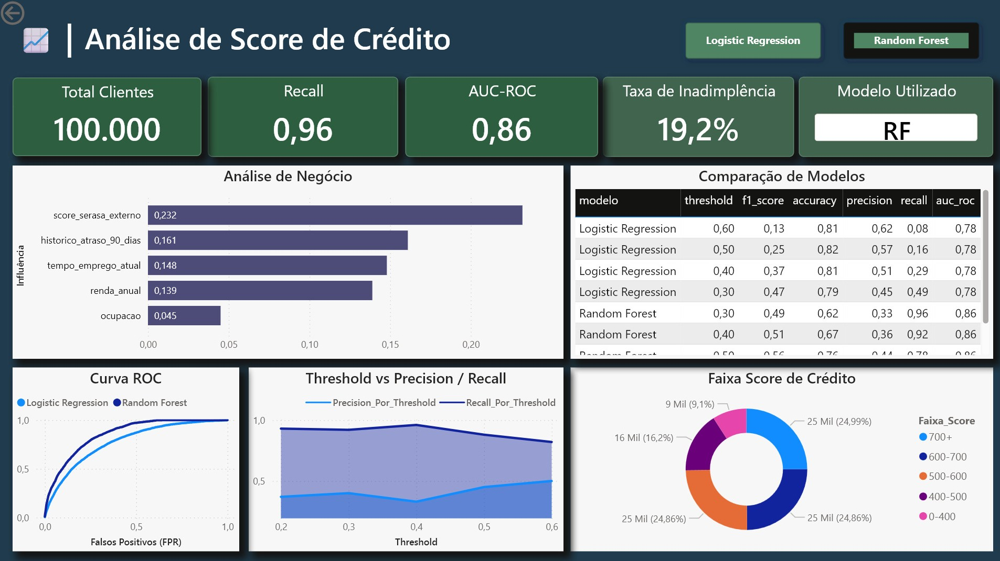
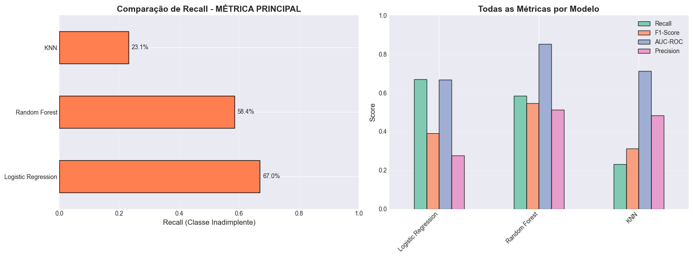
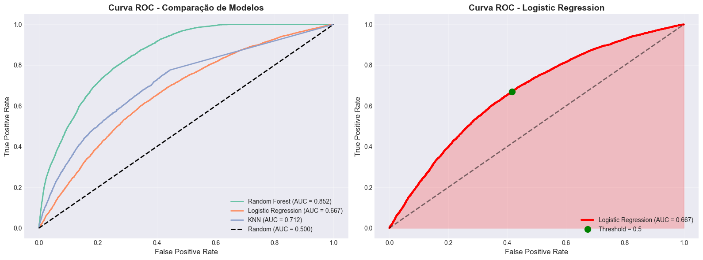
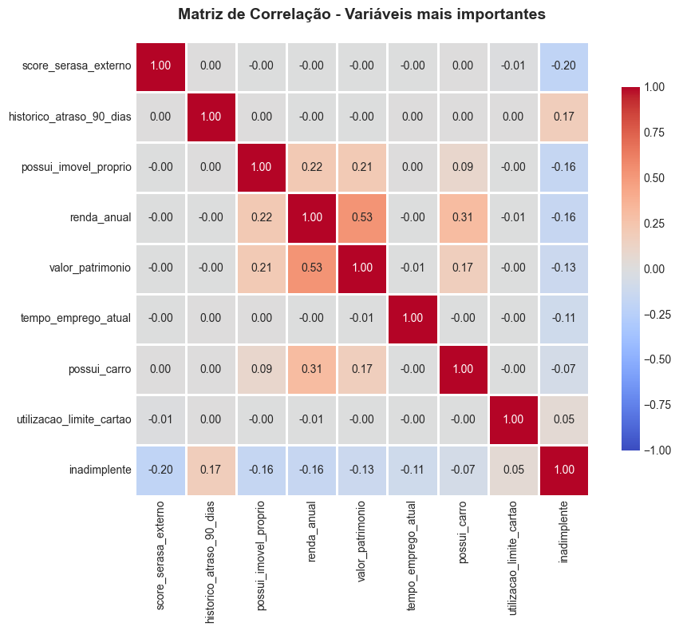
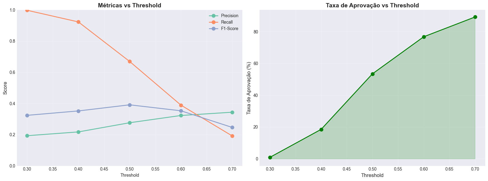

# 🏦 Credit Scoring System with Machine Learning

End-to-end Machine Learning pipeline for Credit Scoring, covering data generation through executive-level visualization in Power BI, with a focus on risk-driven decision making.

## 📊 Overview

This project implements a default prediction system using Machine Learning, simulating a realistic credit scenario with synthetic data and consistent business logic.

The pipeline encompasses:

* Generation of 100,000 synthetic records with risk and protective factors
* Exploratory Data Analysis (EDA)
* Training and comparison of supervised learning models
* Threshold analysis and business trade-offs
* Artifact export for Power BI visualization

## 🎯 Objectives

**Initial screening model** for credit scoring, optimized to **maximize recall** (detect defaulters).

**Practical application:** Clients classified as high-risk are routed to detailed manual analysis, while low-risk clients proceed through automated workflow.

## 🖥️ Dashboard



## 📈 Model Performance

### Logistic Regression (Selected Model)

> Metrics considering recall-optimized threshold

| Metric              | Value  | Interpretation                         |
| ------------------- | ------ | -------------------------------------- |
| **Recall**    | 66.95% | Detects ~2 out of every 3 defaulters   |
| **AUC-ROC**   | 0.667  | Moderate discriminative power          |
| **Precision** | 27.65% | Screening model (high recall priority) |
| **Accuracy**  | 60.01% | Overall accuracy                       |



### Model Comparison (Default Threshold = 0.5)

| Model                         | AUC-ROC | Recall | Precision |
| ----------------------------- | ------- | ------ | --------- |
| **Logistic Regression** | 0.775   | 15.7%  | 57.3%     |
| **Random Forest**       | 0.856   | 77.8%  | 43.5%     |



**Decision rationale:** Despite Random Forest achieving superior metrics in some scenarios, Logistic Regression was prioritized for:

* Model interpretability
* Prediction stability
* Compliance and auditability
* Lower computational overhead
* Better fit for regulated credit environments

## 🔬 Key Insights



### Top 3 Most Important Features

1. **Payment Delay History** — 50.6%
2. **Employment Status** — 23.1%
3. **Number of Dependents** — 15.7%

### Highest Risk Profiles

* **Unemployed:** ~64% default rate
* **Credit Score < 500:** ~37% default rate
* **Annual Income < R$ 30k:** ~29% default rate

### Feature Engineering

* Income Per Capita: Engineered to better capture actual financial capacity

`income_per_capita = annual_income / (num_dependents + 1)` — captures household financial context more effectively than gross income.

## 📁 Project Structure

```
score-credito-ia/
│
├── assets/                              # Visual resources
│
├── data/                                # Raw data
│   ├── database.db                      # SQLite database
│   └── clientes_backup.csv              # CSV backup
│
├── insights/                            # Analysis outputs
│   ├── feature_importance.csv           # Feature importance rankings
│   ├── insights_eda.txt                 # EDA summary
│   └── matriz_correlacao.csv            # Correlation matrix
│
├── models/                              # Trained artifacts
│   ├── encoder_escolaridade.pkl
│   ├── encoder_estado.pkl
│   ├── encoder_estado_civil.pkl
│   ├── encoder_genero.pkl
│   ├── encoder_ocupacao.pkl
│   ├── metadados_modelo.json            # Model metadata
│   ├── modelo_final.pkl                 # Logistic Regression model
│   └── scaler.pkl                       # StandardScaler
│
├── notebooks/                           # Jupyter Notebooks
│   ├── 01_criar_database.ipynb          # Synthetic data generation
│   ├── 02_analise_exploratoria.ipynb    # EDA and correlations
│   ├── 03_modelagem_ml.ipynb            # Model training and validation
│   └── 04_exportar_powerbi.ipynb        # Power BI export pipeline
│
├── powerbi/                             # Visualization datasets
│   ├── confusion_matrix.csv
│   ├── dataset_powerbi.csv              # Main dataset (100k rows)
│   ├── feature_importance_comparison.csv
│   ├── inadimplencia_ocupacao.csv
│   ├── inadimplencia_renda.csv
│   ├── inadimplencia_score.csv
│   ├── model_comparison.csv             # LR vs RF comparison
│   ├── precision_recall_curve.csv
│   ├── roc_curve.csv
│   └── threshold_analysis.csv           # Threshold analysis
│
├── .gitignore                           # Git ignore rules
├── LICENSE                              # Project license
├── README.md                            # Documentation (PT-BR)
├── README-EN.md                         # Documentation (EN-US)
├── ROADMAP.md                           # Future roadmap
└── requirements.txt                     # Python dependencies
```

## 🛠️ Tech Stack

* **Python 3.12+**
* **Pandas**
* **NumPy**
* **Scikit-learn**
* **SQLite**
* **Power BI**

## 🚀 Getting Started

### 1. Install Dependencies

```bash
pip install -r requirements.txt
```

### 2. Run Notebooks (in order)

```bash
# 1. Generate 100k synthetic records
jupyter notebook notebooks/01_criar_database.ipynb

# 2. Exploratory Data Analysis
jupyter notebook notebooks/02_analise_exploratoria.ipynb

# 3. Model training
jupyter notebook notebooks/03_modelagem_ml.ipynb

# 4. Export to Power BI
jupyter notebook notebooks/04_exportar_powerbi.ipynb
```

### 3. Power BI Dashboard

Open Power BI Desktop and import CSVs from `powerbi/` folder:

1. **Get Data** → **Text/CSV**
2. Import all 10 CSV files
3. Create visualizations following the guide below

## 📊 Power BI Dashboard Guide

> The dashboard enables both executive and operational analysis:

### Page 1: Executive Overview

* **KPI Cards:** Default rate, Recall, AUC-ROC, Total clients
* **Chart:** Threshold vs Precision/Recall (dual-line)
* **Slicer:** Interactive threshold (0.3, 0.4, 0.5, 0.6, 0.7)

### Page 2: Model Performance

* **ROC Curve** (LR vs RF comparison)
* **Confusion Matrix** (threshold-filtered)
* **Comparison Table** (LR vs RF)

### Page 3: Feature Importance

* **Bar Chart:** Top 10 most important features
* **Cards:** Top 3 features highlighted

### Page 4: Business Analysis

* **Chart:** Default rate by Employment Status
* **Chart:** Default rate by Credit Score Range
* **Chart:** Default rate by Income Range

### Page 5: Individual Drill-Down

* **Table:** Clients with default probability
* **Filters:** State, Employment, Age, Income
* **Scatter Plot:** Income vs Score (color-coded by default)

## 🎓 Methodology

### 1. Data Generation

* 100,000 synthetic clients
* 16 explanatory variables
* Target generated with realistic business logic

### 2. Exploratory Analysis

* Descriptive statistics
* Correlation analysis
* Risk and protective factors identification

### 3. Modeling

* Train/Test split: 70/30
* Categorical encoding and normalization
* 5-fold cross-validation
* Threshold analysis (17 thresholds tested)
* Model comparison: Logistic Regression vs Random Forest

### 4. Export

* Power BI-ready datasets
* No additional processing required

## 📋 Trade-offs and Business Decisions

### Why Prioritize Recall?

✅ False Negative cost ≈ **R$ 5,000** (~USD 1,000)

✅ False Positive cost ≈ **R$ 1,000** (~USD 200)

✅ False positives can be mitigated through manual review

### Why Logistic Regression?

✅ **Interpretable** — Coefficients = Business rules

✅ **Fast** — Inference latency < 10ms

✅ **Auditable** — Easy to explain for compliance

✅ **Performance** — Meets recall >65% requirement with threshold tuning

### Threshold Trade-off Analysis

| Threshold | Profile      | Precision | Recall |
| --------- | ------------ | --------- | ------ |
| 0.30      | Aggressive   | 44.7%     | 48.8%  |
| 0.50      | Balanced     | 57.3%     | 15.7%  |
| 0.70      | Conservative | 62.7%     | 2.6%   |



## 🔄 Roadmap

* [ ] REST API deployment (FastAPI)
* [ ] Data drift monitoring
* [ ] Automated retraining pipeline
* [ ] A/B testing framework for thresholds
* [ ] CRM system integration

## ⚠️ Disclaimer

This project was developed with focus on study and practical application of Machine Learning in Credit Scoring, using synthetic data and realistic business assumptions.

While following best practices in modeling, evaluation, and decision-making, this is an educational/portfolio project and does not represent a production-grade credit system. Some simplifications were intentionally adopted for didactic and learning purposes.

The primary objective is to demonstrate:

- ML pipeline structuring
- Risk-oriented analysis
- Trade-off based decision making
- Technical and business communication

## 📝 License

This project is licensed under the MIT License. See the [LICENSE](LICENSE) file for details.

## 👨‍💻 Author

Developed by **Vinícius Forte**

- 🐙 GitHub: [vininoronha21](https://github.com/vininoronha21)
- 💼 LinkedIn: [Vinícius Noronha](https://linkedin.com/in/viniciusnoronha)
- 📧 Email: contatovininoronha@gmail.com

---

**Note:** For the Portuguese version, see [README.md](README.md)
